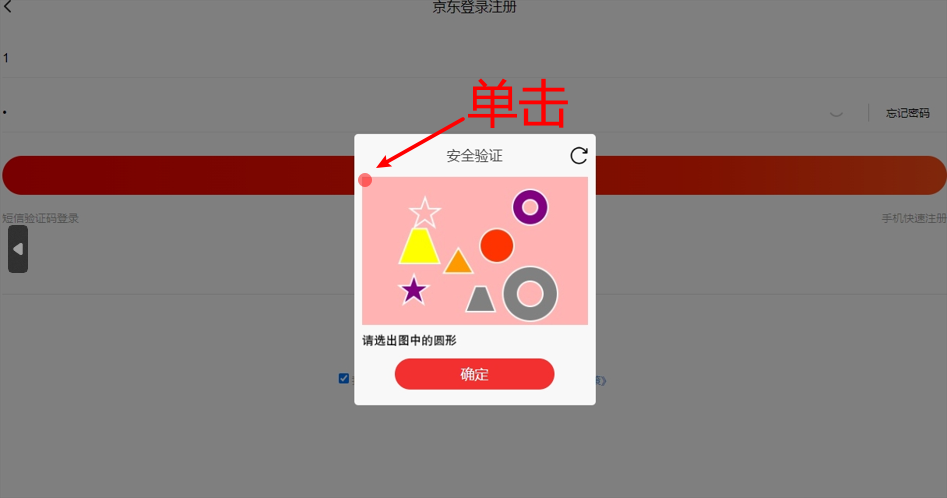
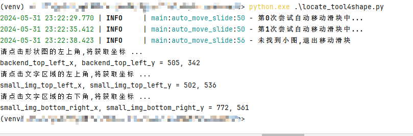

## 20240601 更新
### 更新内容
- 加入了自动验证形状码的方法

### 配置步骤
步骤较繁琐，我们需要拿到几个重要的坐标，请加油！！！
#### 1、需要获取以下三个坐标
```
# 截取文字区域的左上和右下坐标
small_img_top_left_x, small_img_top_left_y = 500, 534  # 左上角坐标
small_img_bottom_right_x, small_img_bottom_right_y = 800, 559  # 右下角X坐标

# 形状图的左上角坐标
backend_top_left_x, backend_top_left_y = 505, 340
```

#### 2、运行脚本
```commandline
python locate_tool4shape.py
```

- 运行后，等待浏览器自动滑块后进入形状验证码后，进行操作脚本会捕获鼠标的点击事件。
- 按下图1,2,3顺序点击,获取三个坐标
- 点1位于形状图片最左上角的位置，用于计算形状的坐标
- 点2，3用于截图文字内容，进行识别




- 运行情况如下图



#### 3、添加配置
编辑config.py，填入获取到的值

```commandline
# 是否自动形状验证码识别，有时不准，就关掉吧
auto_shape_recognition = True

# 形状图的左上角坐标
backend_top_left_x, backend_top_left_y = 505, 340

# 截取文字区域的左上和右下坐标
# 左上角坐标
small_img_top_left_x, small_img_top_left_y = 500, 534  
# 右下角坐标
small_img_bottom_right_x, small_img_bottom_right_y = 800, 559  
```


# MyJdCOOKIE

### 介绍
- 用来自动化更新青龙面板的失效JD_COOKIE, 主要有三步
    - 自动化获取青龙面板的失效JD_COOKIE
    - 基于失效JD_COOKIE, 自动化登录JD,包括滑块验证, 拿到key
    - 基于key, 自动化更新青龙面板的失效JD_COOKIE
- python >= 3.9 (playwright依赖的typing，在3.7和3.8会报错typing.NoReturn的BUG)
- 基于windows
- 整体效果如下图


### TODOLIST
- 批量更新多账号(已实现)
- selenium加载太慢，用playwright改写(已实现)
- 自动识别拖动验证码(已实现，but成功率为90%，且偶尔会被JD识别)
- 加日志(已实现)
- 写使用文档(已实现)
- 加一些通知如钉钉等
- 添加获取滑块x,y坐标的工具(已实现)
- 加入了自动验证形状码的方法(已实现)

## 使用文档
### 安装依赖
```commandline
pip install -r requirements.txt
```

### 安装chromium插件
```commandline
playwright install chromium
```

### 获取滑块的坐标
```commandline
python locate_tool.py
```
运行脚本后，将鼠标放置到滑块处，按下ctrl+c退出，打到终端打印的坐标，参考下图


### 配置形状验证码的内容
####  **详见20240601 更新**

### 添加配置
- 复制config_example.py, 重命名为config.py, 我们基于这个config.py运行程序;
- slide_x_position, slide_y_position用locate_tool.py拿到;
- auto_move为自动识别并移动滑块验证码的开关, 有时不准就关了;
- slide_difference为滑块验证码的偏差, 如果一直滑过了, 或滑不到, 需要调节下;
- 有时多次失败，滑块验证码会变成其它验证码，或需要收到短信验证码，需要手动处理;
- 其它配置按实际填写.

### 运行脚本
```commandline
python main.py
```

### 特别感谢
- 感谢 **https://github.com/sml2h3/ddddocr** 项目，牛逼项目