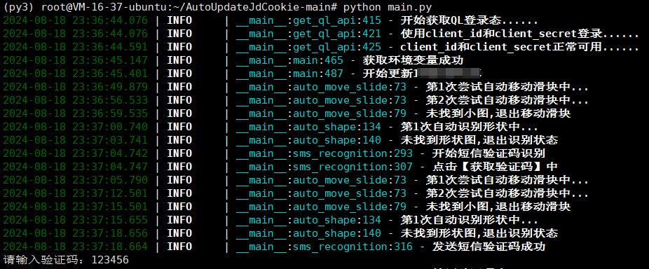

# aujc

## 介绍
- 用来自动化更新青龙面板的失效JD_COOKIE, 主要有三步
    - 自动检测并获取青龙面板的失效JD_COOKIE;
    - 拿到失效JD_COOKIE内容后, 根据配置的账号信息, 自动化登录JD页面, 拿到key;
    - 根据拿到的key, 自动化更新青龙面板的失效JD_COOKIE。
- 支持的验证码类型有：
  - 滑块验证码;
  - 形状颜色验证码(基本不会出现了);
  - 点选验证码;
  - 短信验证码,支持手动输入和webhook(首次登录大概率出现, 其它时间出现频率低。webhook配置流程繁琐, 不爱折腾的建议使用手动输入或关闭。)
- 支持的账号类型有：
  - 账号密码登录
  - QQ登录
- python >= 3.9 (playwright依赖的typing，在3.7和3.8会报错typing.NoReturn的BUG)
- 支持windows,linux(无GUI)
- 支持docker部署
- 支持代理
- linux无GUI使用文档请转向 [linux无GUI使用文档](https://github.com/icepage/AutoUpdateJdCookie/blob/main/README.linux.md)
- WINDOWS整体效果如下图


## 使用文档
## 1、docker部署(推荐)

### 下载镜像
```shell
docker pull icepage/aujc:latest
```

### 配置config.py
- 下载本项目的config_example.py, 重命名为config.py; 
- 配置config.py, 配置文件说明请转向 [配置文件说明](https://github.com/icepage/AutoUpdateJdCookie/blob/main/配置文件说明.md)
- config.py的**cron_expression**参数必填;
- config.py的**headless一定要设为True!!!!**

### 手动执行
- 2种场景下需要手动
  - 1、需要短信验证时需要手动, 本应用在新设备首次更新时必现. 
  - 2、定时时间外需要执行脚本. 
- 配置中的sms_func设为manual_input时, 才能在终端填入短信验证码。
- 当需要手动输入验证码时, docker运行需加-i参数。否则在触发短信验证码时会报错Operation not permitted
```bash
docker run -i -v $PWD/config.py:/app/config.py icepage/aujc:latest python main.py
```



### 长期运行
- 程序读config.py中的cron_expression, 定期进行更新任务
- 当sms_func设置为manual_input, 长期运行时会自动将manual_input转成no，避免滥发短信验证码, 因为没地方可填验证码. 
```bash
docker run -v $PWD/config.py:/app/config.py icepage/aujc:latest
```

## 2、本地部署
### 安装依赖
```commandline
pip install -r requirements.txt
```

### 安装chromium插件
```commandline
playwright install chromium
```

### 添加配置config.py
- 复制config_example.py, 重命名为config.py, 我们基于这个config.py运行程序;
- 配置config.py, 配置文件说明请转向 [配置文件说明](https://github.com/icepage/AutoUpdateJdCookie/blob/main/配置文件说明.md)


### 运行脚本
#### 1、单次手动执行
```commandline
python main.py
```

#### 2、常驻进程
进程会读取config.py里的cron_expression,定期进行更新任务
```commandline
python schedule_main.py
```

## 特别感谢
- 感谢 [所有赞助本项目的热心网友 --> 打赏名单](https://github.com/icepage/AutoUpdateJdCookie/wiki/%E6%89%93%E8%B5%8F%E5%90%8D%E5%8D%95)
- 感谢 **https://github.com/sml2h3/ddddocr** 项目，牛逼项目
- 感谢 **https://github.com/zzhjj/svjdck** 项目，牛逼项目

## 创作不易，如果项目有帮助到你，你可以打赏下作者

